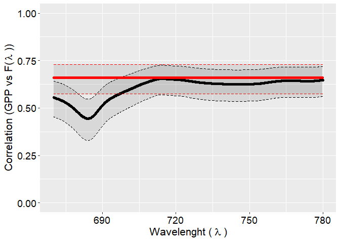

Fluorescence - BEPE
================
Costa, L. M; Cogliati, S.; Cesana, I.; Colombo, R.; La Scala Jr., N.

# **First Statments**

This repository is part of a project financed by the [*São Paulo state
research support foundation (FAPESP)*](https://fapesp.br/en) under the
process
[2021/06477-0](https://bv.fapesp.br/en/bolsas/197773/evaluation-of-different-approaches-for-the-retrieval-of-sun-induced-fluorescence/)

The proposed method for Fluorescence Re-absorption Corrected (F-RC) is
based on the Phd thesis from [Cesana,
I.](https://www.researchgate.net/profile/Ilaria-Cesana), the thesis is
not avaialable yet.

More about whow the data was processed can be found in the folowings
repositories: [Draft 1](https://github.com/lm-costa/draft_bepe) and
[Draft 2](https://github.com/lm-costa/draft_2_bepe)

# **Data**

The data consist in a time-series from 24th may from 14th july of 2018,
and the measuremenst of the fluorescence was in an alfalfa crop in
Grosseto Italy. More about the retrieval of the fluoresnce at Top Of
Canopy can be found in [Cogliati et al.,
2019](https://doi.org/10.3390/rs11161840)

The folder `data` contains all processed data in two different sky
conditions: **i)clear sky days**; **ii)partial clound days**.

The data avaialable in the folders were retrieved by the codes `clear.R`
and `partial.R`, founded in the `R` folder. the other codes avaialables
in the folder are basicaly the same, however with some restrictions or a
different aproach in some formulation, where, the condition of sky
(clear or partial) folowing:

1.  SZA: the interval of the Solar Zenital Angle was set in the interval
    of 20 to 50 degress

2.  day: the analyses was made by just 2 days

3.  L750: For the Re-absorption correction the Ligth incoming at 750 nm
    was used instead of the cos(SZA)

# **Model**

We applied two methods of modelling:

1.  Random Forest Analyses

2.  Stepwise regression

# **Figures**

All figures can be reproduced using the code `graphs.R`, however, here
are the example of the Pearson’s correlation between GPP and The F full
spectra:

``` r
correl_partial <- readr::read_rds("data/partial/correl.rds")
correl_frc_partial <- readr::read_rds("data/partial/correl_frc.rds")

correl_partial[-c(683,684),] |>
  ggplot2::ggplot(ggplot2::aes(x=V4,y=correl,ymax=uper,ymin=lower))+
  ggplot2::geom_ribbon(alpha=.1,linetype="dashed",color="black")+
  ggplot2::geom_jitter(color="black")+
  ggplot2::geom_ribbon(ggplot2::aes(ymax=correl_frc_partial$uper[-c(683,684)],
                                    ymin=correl_frc_partial$lower[-c(683,684)]),
                       color='red', linetype='dashed',alpha=.1)+
  ggplot2::geom_point(ggplot2::aes(x=correl_frc_partial$V4[-c(683,684)],
                                    y=correl_frc_partial$correl_fr[-c(683,684)]),
                      color='red')+
  ggplot2::ylim(0,1)+
  ggplot2::labs(x=expression("Wavelenght ("~ lambda ~")"),
                y=expression('Correlation (GPP vs F('~lambda~'))' ))+
  ggplot2::theme(axis.title= ggplot2::element_text(size=16),
                 axis.text = ggplot2::element_text(size=14,color='black'))
```

<!-- -->

# **Final Statment**

The data are avaialable for non commercial use.

This repositorie has to be properlie cited in any kind of publication or
material, as well the [Draft 1](https://github.com/lm-costa/draft_bepe),
[Draft 2](https://github.com/lm-costa/draft_2_bepe),[Cogliati et al.,
2019](https://doi.org/10.3390/rs11161840), the Cesana Thesis when turne
avaiable…
